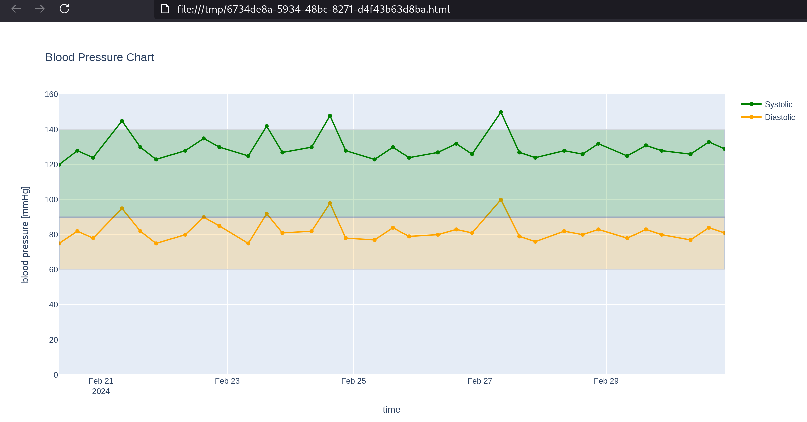

# Blood Pressure Visualization

A side project..

I have a Nextcloud file in markdown format to record my blood pressure.

This project takes that markdown file, converts it into a CSV file, and displays it using [Plotly.NET](https://plotly.net/).

Plotly is very interactive, which is great for exploratory analysis.

Here is an example image:

See [./BloodPressure/README.md](/BloodPressure/README.md) for details.
